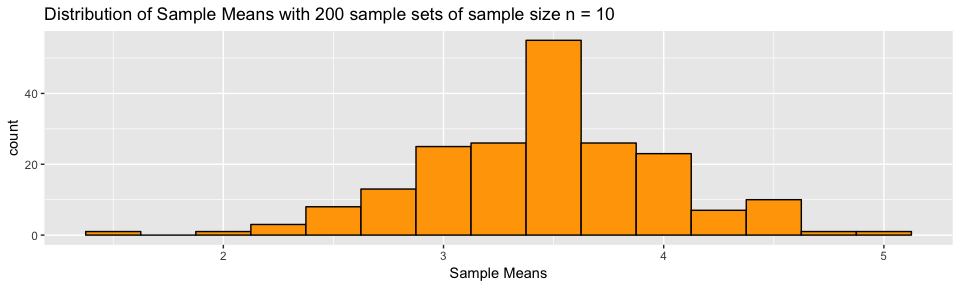
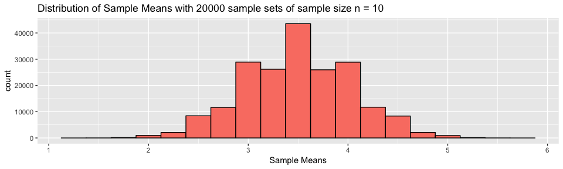
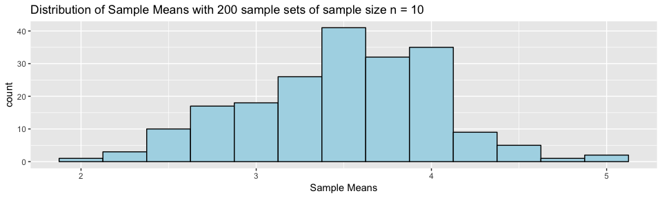
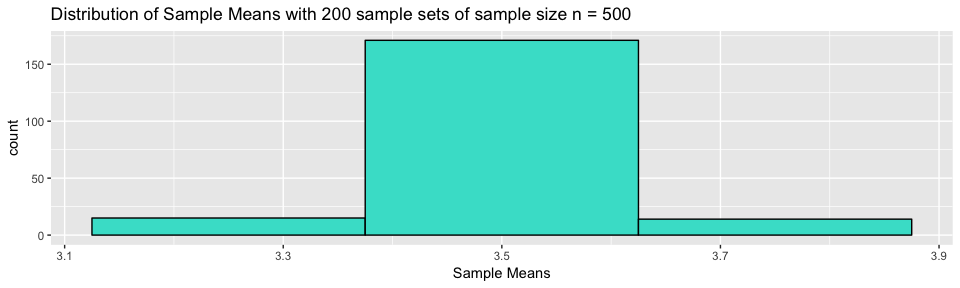

Visualizing the Central Limit Theorum
================
Shweta Purushe
06/1/2018

``` r
library(ggplot2)
```

    ## Warning: package 'ggplot2' was built under R version 3.4.4

### Trials

##### Let us create a sample of 10 trials of throwing the dice i.e. one sample set of sample size = 10 (n=10)

``` r
set.seed(1)
# A sample (Group of results gathered from separate independent trials.) of 10 trials
s_10 <- sample(1:6, 10, replace = T) 

s_10
```

    ##  [1] 2 3 4 6 2 6 6 4 4 1

##### Lets see what a larger sample set of 100 trials looks like? (n=100)

``` r
s_100 <- sample(1:6, 100, replace = T)

s_100
```

    ##   [1] 2 2 5 3 5 3 5 6 3 5 6 2 4 1 2 3 1 3 6 3 3 4 3 2 5 5 5 1 5 3 5 4 5 4 4
    ##  [36] 5 1 3 5 5 3 6 3 2 1 1 2 4 4 3 6 2 3 2 4 2 3 5 1 6 3 6 3 3 3 6 6 3 5 6
    ##  [71] 3 5 3 2 5 2 5 1 2 1 2 1 4 6 5 5 3 3 5 4 4 3 2 6 4 2 1 3 6 4

You get the picture.

The 'replace' parameter is set to True because each trial with an observation should be independent, i.e. the outcome of throwing the dice once should not influence the next outcome.

This ties to the **'iid'** expectation of the CLT, which means that the samples should be drawn in the same way and from the same underlying population distribution. The trials should be **independent** and **identically distributed**.

Now lets look at the mean of these samples.
The mean is 3.5. \[ i.e. ( 1 + 2 + 3+ 4 + 5 + 6) = 21/ 6\]

``` r
m_10 <- mean(s_10)
print(m_10)
```

    ## [1] 3.8

``` r
m_100 <- mean(s_100)
print(m_100)
```

    ## [1] 3.56

Our estimates, called sample means, of the actual mean are pretty close as can be seen in the code chunks above.

<br> <br>

##### Part 1 Increasing Sample Set iterations

All of the above was for a single sample set, lets try it for say 200 sample sets of sample size n = 10

``` r
# generate a list of 200 sample sets, each with a sample size of 10. 
sample_reps = 200

s_200_collection <- data.frame(replicate(sample_reps, mean(sample(1:6, 10, replace = T))))
names(s_200_collection) <- "values"

ggplot( data = s_200_collection, aes(x = values) ) + 
geom_histogram(binwidth=0.25, colour="black", fill="orange")  +
xlab("Sample Means") + 
labs(title= "Distribution of Sample Means with 200 sample sets of sample size n = 10")
```



``` r
# generate a list of 200,000 sample sets, each with a sample size of 10. 
sample_reps = 200000

s_200000_collection <- data.frame(replicate(sample_reps, mean(sample(1:6, 10, replace = T))))
names(s_200000_collection) <- "values"

ggplot(data = s_200000_collection, aes(x = values))  + 
geom_histogram(binwidth=0.25, colour="black", fill="salmon")  +
xlab("Sample Means") + 
labs(title= "Distribution of Sample Means with 20000 sample sets of sample size n = 10")
```



Can you notice that the data is getting more normally distributed as we increase the number of sample sets we create from 200 to 20000? <br> <br> <br> <br>

##### Part 2 Increasing Sample Size

The first part of this exercise is to visualize Central Limit Theorum as we increase the number of sample sets. Remember all of them had an identical sample size of 10 (i.e. n = 10). <br> Now lets do the second part of the exercise which is to visualize the CLT as we increase the sample size i.e. n, from 10 to 10000. We will keep the number of sample sets the same, 200.

``` r
## We've done this before!!

# generate a list of 200 sample sets, each with a sample size of 10. 
sample_size = 10

s_10_collection <- data.frame(replicate(200, mean(sample(1:6, sample_size, replace = T))))
names(s_10_collection) <- "values"

ggplot(data = s_10_collection, aes(x=values)) + 
geom_histogram(binwidth=0.25, colour="black", fill="lightblue")  +
xlab("Sample Means") + 
labs(title= "Distribution of Sample Means with 200 sample sets of sample size n = 10")
```



``` r
# generate a list of 200 sample sets, each with a sample size of 500. 
sample_size = 500

s_500_collection <- data.frame(replicate(200, mean(sample(1:6, sample_size, replace = T))))
names(s_500_collection) <- "values"

ggplot(data=s_500_collection, aes(x=values )) + 
geom_histogram(binwidth=0.25, colour="black", fill="turquoise")  +
xlab("Sample Means") + 
labs(title= "Distribution of Sample Means with 200 sample sets of sample size n = 500")
```



<br> Now this may look weird, you might be expecting a smooth bell shaped histogram. <br>But look at how many of these values out of 200 sample sets, are closer to the actual mean that we expect ? Around 180 out of 200 sample sets have a mean close to 3.5. <br> Whereas in the previous figure, only 50 out of 200 were close to 3.5.

##### Meaning, as we increase our sample size from 10 to 500, a larger portion of our sample sets have a sample mean closer to the actual mean.
