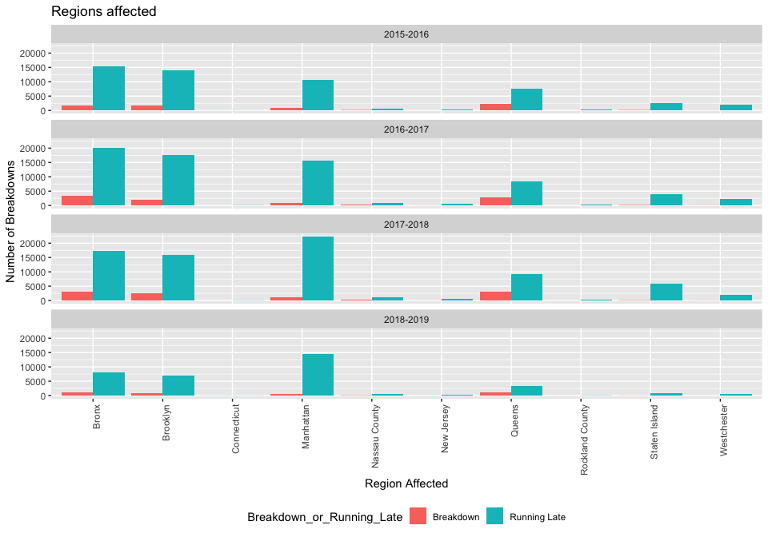
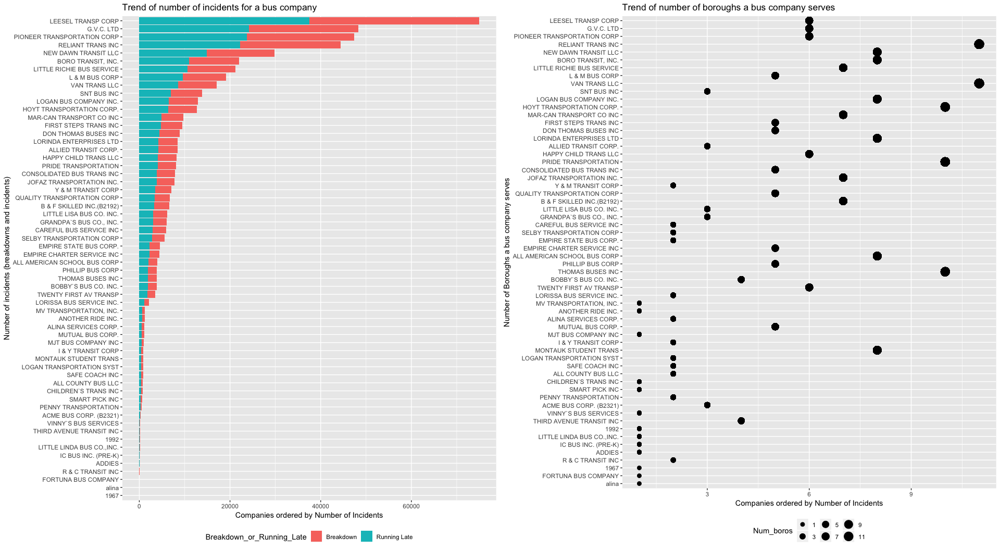
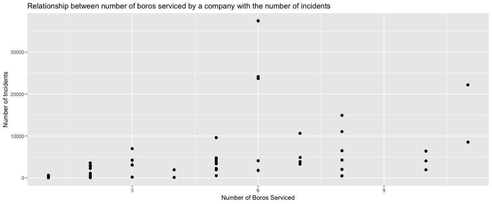
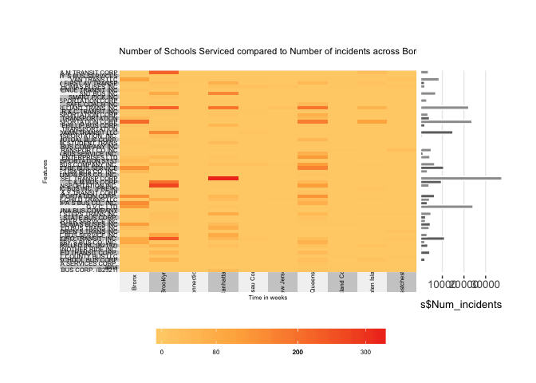
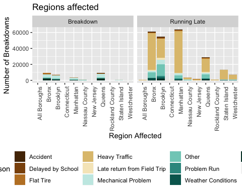
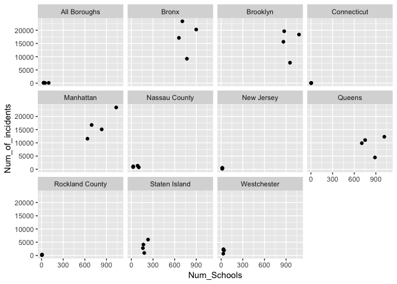

New York Bus breakdown analysis by regions
================
Shweta Purushe
12/18/2018

``` r
# Questions I am trying to answer for geo region analysis 

# Which Region has had the maximum incidents over time?

# which region has improved/ done the same/ detriorated over years 

#. Which incidents ? Breakdowns or Running late 

#Why? 
# Is there a relationship between the number of buses plying to each borough and the incidents -- unfortunately this data is not provided. 
# Are the bus incidents a specific company problem? 
# Are there too many schools being serviced ? 
# Are there too many children on the bus route? (we unfortunately dont have enough data for this)
# reason for getting late --(in the data)  


# Which type of students are getting most affected in a region. 

# Within a region which is the best / worst company ?? 
```

``` r
bus_df <- read_csv("/Users/spurushe/Downloads/ny-bus-breakdown-and-delays/bus-breakdown-and-delays.csv")
```

    ## Parsed with column specification:
    ## cols(
    ##   .default = col_character(),
    ##   Busbreakdown_ID = col_integer(),
    ##   Occurred_On = col_datetime(format = ""),
    ##   Created_On = col_datetime(format = ""),
    ##   Number_Of_Students_On_The_Bus = col_integer(),
    ##   Informed_On = col_datetime(format = ""),
    ##   Last_Updated_On = col_datetime(format = "")
    ## )

    ## See spec(...) for full column specifications.

``` r
bus_df %>% head()
```

    ## # A tibble: 6 x 21
    ##   School_Year Busbreakdown_ID Run_Type     Bus_No Route_Number Reason     
    ##   <chr>                 <int> <chr>        <chr>  <chr>        <chr>      
    ## 1 2015-2016           1212699 Special Ed … 48186  N758         Other      
    ## 2 2015-2016           1212700 Special Ed … 2518   L530         Mechanical…
    ## 3 2015-2016           1212701 Special Ed … 235    K168         Other      
    ## 4 2015-2016           1212703 Special Ed … 2102   K216         Other      
    ## 5 2015-2016           1212704 Special Ed … 48162  N861         Mechanical…
    ## 6 2015-2016           1212705 Special Ed … 110    W920         Mechanical…
    ## # ... with 15 more variables: Schools_Serviced <chr>, Occurred_On <dttm>,
    ## #   Created_On <dttm>, Boro <chr>, Bus_Company_Name <chr>,
    ## #   How_Long_Delayed <chr>, Number_Of_Students_On_The_Bus <int>,
    ## #   Has_Contractor_Notified_Schools <chr>,
    ## #   Has_Contractor_Notified_Parents <chr>, Have_You_Alerted_OPT <chr>,
    ## #   Informed_On <dttm>, Incident_Number <chr>, Last_Updated_On <dttm>,
    ## #   Breakdown_or_Running_Late <chr>, School_Age_or_PreK <chr>

<br/> <br/>

#### Which Region has had the maximum incidents over time?

``` r
# Which Region has had the maximum incidents over time?

bus_df %>% 
  select(Boro, School_Year) %>% filter(!is.na(Boro), School_Year!='2019-2020') %>%
  group_by(School_Year, Boro)  %>% 
  summarise(n_of_incidents = n()) %>%
  filter(n_of_incidents == max(n_of_incidents))
```

    ## Warning: package 'bindrcpp' was built under R version 3.4.4

    ## # A tibble: 4 x 3
    ## # Groups:   School_Year [4]
    ##   School_Year Boro      n_of_incidents
    ##   <chr>       <chr>              <int>
    ## 1 2015-2016   Bronx              17120
    ## 2 2016-2017   Bronx              23389
    ## 3 2017-2018   Manhattan          23390
    ## 4 2018-2019   Manhattan          15107

Looks like Bronx and Manhattan are the most affected regions across four years.

<br/>

#### What are the major types of Incidents ? Are there more breakdowns or istances of buses runnning late?

``` r
# What are the major types of Incidents ? Are there more breakdowns or istances of buses runnning late?


affected_regions <- bus_df %>% 
  select(Boro, School_Year, Breakdown_or_Running_Late) %>% filter(!is.na(Boro), Boro != 'All Boroughs',  School_Year!='2019-2020') %>%
  count(School_Year, Boro, Breakdown_or_Running_Late) %>%
  rename(Num_of_Incidents = n)


#plotting
affected_regions %>%
  ggplot(aes(x =Boro, y= Num_of_Incidents, fill=Breakdown_or_Running_Late)) + 
  geom_bar(stat="identity", position = "dodge") + 
  labs(x = "Region Affected", y="Number of Breakdowns", title="Regions affected") +
  theme(axis.text.x = element_text(angle = 90, hjust = 1), legend.position = "bottom") + 
  facet_wrap(~School_Year, ncol=1)
```



<br/>

**Conclusions from the figure above**

-   Across all boroughs, buses are running late more than they're breaking down.
-   As we see above, it looks like in additon to Bronx and Manhattan, Brooklyn is a close third.
-   Bronx and Brooklyn have more number of breakdowns compared to Manhattan.

<br/>

#### Which region has improved/ done the same/ detriorated over years?

And all regions have improved in their services from 2015 to 2018. (reduced number of incidents)

<br/>

Now that we have a slight idea of 'what' is happening, lets try to figure out WHY this is happening ?

<br/>

------------------------------------------------------------------------

<br/>

#### Let us now look into investigating the reasons for bus incidents

``` r
#Why? Answers to these questions could provide some clues. 

# Is there a relationship between the number of buses plying to each borough and the incidents -- unfortunately this data is not provided. On proxy that can be used for this is, is there a relationship between the number of boroughs serviced by a company to the number of its bus incidents?

# Are the bus incidents a specific company problem? --cant answer this question without number of buses plying. Without normalization any conclusion is wrong. 

# are there too many schools being serviced ? 

# Are there too many children on the bus route? (we unfortunately dont have enough data for this)

# reason for getting late --(in the data) 
```

``` r
#Are the bus incidents a specific company problem? 
# Lets see the distribution of incidents across the various bus companies

bus_df %>% 
  select(Bus_Company_Name, Breakdown_or_Running_Late) %>% filter(Bus_Company_Name != '`') %>%
  group_by(Bus_Company_Name) %>% count()
```

    ## # A tibble: 116 x 2
    ## # Groups:   Bus_Company_Name [116]
    ##    Bus_Company_Name                  n
    ##    <chr>                         <int>
    ##  1 1967                              1
    ##  2 1992                            102
    ##  3 ACME BUS CORP. (B2321)         1602
    ##  4 ADDIES                           26
    ##  5 alina                             1
    ##  6 ALINA SERVICES CORP.            533
    ##  7 ALL AMERICAN SCHOOL BUS C      1269
    ##  8 ALL AMERICAN SCHOOL BUS CORP.   746
    ##  9 ALL COUNTY BUS LLC (B2321       255
    ## 10 ALL COUNTY BUS LLC (B2321)      114
    ## # ... with 106 more rows

``` r
# We need to clean up the bus company names a bit since the names are very nearly identical but dont help in aggregating. 
#For eg. ALL AMERICAN SCHOOL BUS C and ALL AMERICAN SCHOOL BUS CORP. are the same company. 
# This could be attributed to different people having different styles for entering the same company name 


clean_bus_names <- bus_df %>% 
  filter(Bus_Company_Name != '`', !is.na(Boro)) %>%
  mutate(Clean_BusCo_name = 
           case_when (grepl('^ALL AMERICAN SCHOOL.*', Bus_Company_Name, ignore.case = TRUE) ~ "ALL AMERICAN SCHOOL BUS CORP" ,
                      grepl('^ALL COUNTY BUS LLC.*', Bus_Company_Name, ignore.case = TRUE) ~ "ALL COUNTY BUS LLC",
                      grepl('^CAREFUL.*', Bus_Company_Name, ignore.case = TRUE) ~ "CAREFUL BUS SERVICE INC",
                      grepl('^CHILDREN`S TRANS.*', Bus_Company_Name, ignore.case = TRUE) ~ "CHILDREN`S TRANS INC",
                      grepl('^CONSOLIDATED BUS TRANS.*', Bus_Company_Name, ignore.case = TRUE) ~ "CONSOLIDATED BUS TRANS INC",
                      grepl('^Don Thomas Bus.*', Bus_Company_Name, ignore.case = TRUE) ~ "DON THOMAS BUSES INC",
                      grepl('^EMPIRE CHARTER SERVICE.*', Bus_Company_Name, ignore.case = TRUE) ~ "EMPIRE CHARTER SERVICE INC",
                      grepl('^FIRST STEPS.*', Bus_Company_Name, ignore.case = TRUE) ~ "FIRST STEPS TRANS INC",
                      grepl('^G.V.C.*|gvc', Bus_Company_Name, ignore.case = TRUE) ~ "G.V.C. LTD",
                      grepl('^HAPPY CHILD TRANS.* ', Bus_Company_Name, ignore.case = TRUE) ~ "HAPPY CHILD TRANS LLC",
                      grepl('^L & M BUS CORP.*|L&M Bus Corp', Bus_Company_Name, ignore.case = TRUE) ~ "L & M BUS CORP",
                      grepl('^LEESEL TRANS.*CORP.*', Bus_Company_Name, ignore.case = TRUE) ~ "LEESEL TRANSP CORP",
                      grepl('^LOGAN TRANSPORTATION SYST.*', Bus_Company_Name, ignore.case = TRUE) ~ "LOGAN TRANSPORTATION SYST",
                      grepl('^LORINDA ENT.*LTD.', Bus_Company_Name, ignore.case = TRUE) ~ "LORINDA ENTERPRISES LTD",
                      grepl('^MAR-CAN TRANSPORT CO.*', Bus_Company_Name, ignore.case = TRUE) ~ "MAR-CAN TRANSPORT CO INC",
                      grepl('^MJT BUS.*', Bus_Company_Name, ignore.case = TRUE) ~ "MJT BUS COMPANY INC",
                      grepl('^MONTAUK STUDENT TRANS.*', Bus_Company_Name, ignore.case = TRUE) ~ "MONTAUK STUDENT TRANS",
                      grepl('^MUTUAL BUS CORP.*', Bus_Company_Name, ignore.case = TRUE) ~ "MUTUAL BUS CORP.",
                      grepl('^NEW DAWN TRANSIT.*', Bus_Company_Name, ignore.case = TRUE) ~ "NEW DAWN TRANSIT LLC",
                      grepl('^^philli.*[p|s] BUS.*', Bus_Company_Name, ignore.case = TRUE) ~ "PHILLIP BUS CORP",
                      grepl('^PIONEER TRANSPORTATION CO.*', Bus_Company_Name, ignore.case = TRUE) ~ "PIONEER TRANSPORTATION CORP",
                      grepl('^PRIDE TRANSPORTATION.*', Bus_Company_Name, ignore.case = TRUE) ~ "PRIDE TRANSPORTATION",
                      grepl('^QUALITY TRANSPORTATION CO.*', Bus_Company_Name, ignore.case = TRUE) ~ "QUALITY TRANSPORTATION CORP",
                      grepl('^R & C TRANSIT.*', Bus_Company_Name, ignore.case = TRUE) ~ "R & C TRANSIT INC",
                      grepl('^RELIANT TRANS.*', Bus_Company_Name, ignore.case = TRUE) ~ "RELIANT TRANS INC",
                      grepl('^SAFE COACH INC.*', Bus_Company_Name, ignore.case = TRUE) ~ "SAFE COACH INC",
                      grepl('^SELBY TRANS.*', Bus_Company_Name, ignore.case = TRUE) ~ "SELBY TRANSPORTATION CORP",
                      grepl('^SMART PICK.*', Bus_Company_Name, ignore.case = TRUE) ~ "SMART PICK INC",
                      grepl('^THIRD AVENUE TRANSIT.*', Bus_Company_Name, ignore.case = TRUE) ~ "THIRD AVENUE TRANSIT INC",
                      grepl('^THOMAS BUSES.*', Bus_Company_Name, ignore.case = TRUE) ~ "THOMAS BUSES INC",
                      grepl('^TWENTY FIRST AV TRANSP.*', Bus_Company_Name, ignore.case = TRUE) ~ "TWENTY FIRST AV TRANSP",
                      grepl('^VAN TRANS.*', Bus_Company_Name, ignore.case = TRUE) ~ "VAN TRANS LLC",
                      grepl('^VINNY`S BUS SERVICES.*', Bus_Company_Name, ignore.case = TRUE) ~ "VINNY`S BUS SERVICES",
                      grepl('^Y & M TRANSIT CORP.*', Bus_Company_Name, ignore.case = TRUE) ~ "Y & M TRANSIT CORP",
                      TRUE ~ Bus_Company_Name
                      )
         ) 

x_dirty = clean_bus_names %>% select(Bus_Company_Name) %>% distinct() %>% count()
x = clean_bus_names %>% select(Clean_BusCo_name) %>% distinct() %>% count()

cat("Before cleaning number of bus companies :", x_dirty$n)
```

    ## Before cleaning number of bus companies : 116

``` r
cat("\nAfter cleaning number of bus companies: ", x$n)
```

    ## 
    ## After cleaning number of bus companies:  60

``` r
# Now lets look at the distribution with the clean company names
company_incident_counts <- clean_bus_names %>% count(Clean_BusCo_name) %>% rename(Num_incidents = n) # this will give number of incidents per company 
company_borough_counts <- clean_bus_names %>% group_by(Clean_BusCo_name)%>% distinct(Boro) %>% count() %>% rename(Num_boros = n) # number of distinct boroughs serviced by each company


# Putting all this information together 
all_company_info <- clean_bus_names %>% inner_join(company_incident_counts, by="Clean_BusCo_name") %>% inner_join(company_borough_counts, by="Clean_BusCo_name")
comp_names = factor(as.character(all_company_info$Clean_BusCo_name), levels = unique(all_company_info$Clean_BusCo_name))


#Plotting
plot1 <- all_company_info %>% select(Clean_BusCo_name, Num_incidents, Breakdown_or_Running_Late)%>%distinct() %>%
          ggplot(aes(x = reorder(Clean_BusCo_name, Num_incidents), y=Num_incidents, fill=Breakdown_or_Running_Late)) + geom_bar(stat="identity") + 
          labs(x="Number of incidents (breakdowns and incidents)", y="Companies ordered by Number of Incidents", title="Trend of number of incidents for a bus company")+
          coord_flip() +theme(legend.position = 'bottom')


 
 
plot2 <- all_company_info%>%
        ggplot(aes(x=reorder(comp_names, Num_incidents), y=Num_boros)) +
        geom_point(aes(size=Num_boros)) + 
        scale_size_continuous(
                          breaks = seq(from=1, to=max(all_company_info$Num_boros), by=2),
                          limits = c(0 , 12),
                          labels = seq(from=1, to=max(all_company_info$Num_boros), by=2)
                ) +
        labs(x="Number of Boroughs a bus company serves", y="Companies ordered by Number of Incidents", title="Trend of number of boroughs a bus company serves")+
        coord_flip() + theme(legend.position = 'bottom')


grid.arrange(plot1, plot2, ncol=2)
```



<br/>

**Conclusions from the figure above**

-   From the figure on the left
-   We can identify the companies which have the most number of breakdowns.
-   But we have no information regarding the number of buses plying for each company. This would have helped identify if a company is not providing good service. The proportion of bus incidents to the number of buses plying by a certain company would have been a good indicator of the reliability and service experience of that bus company. It would also have helped us identify the bad buses :D.
-   But without that information, we cannot conclude that just because a company has more number of incidents, the bus company does not have good service experience.
-   A reasonable thought would be that more the boros serviced, the more the incidents. Comparing the figure on the left and right, we can see that there is no apparent relationship between the number of bus incidents for a company and the different boroughs it plies to.

<br/>

#### Lets see if a relationship exists between the number of Boros serviced by a company and the number of incidents

``` r
all_company_info %>% 
  ggplot(aes(x=Num_boros, y=Num_incidents)) + geom_point() +
  labs(title ="Relationship between number of boros serviced by a company with the number of incidents", x="Number of Boros Serviced", y="Number of Incidents")
```



``` r
#Another way to calculate company_borough_counts

# b_s<- clean_bus_names %>%
#   group_by(Clean_BusCo_name) %>%
#   summarize(Boros_Serviced = paste(unique(Boro), collapse = ','), Num_Boros_Serviced = length(unique(Boro))) 

# g1 <- clean_bus_names %>%
#           count(Clean_BusCo_name)%>% # number of incidents (breakdowns and late runnings) for a given company 
#           arrange(desc(n)) %>%
#   inner_join(b_s, by="Clean_BusCo_name") %>%
#   # PLOT
#   ggplot(aes(x = Num_Boros_Serviced, y = n)) + 
#   geom_point() + 
#   labs(title ="Relationship between number of boros serviced by a company with the number of incidents", x="Number of Boros Serviced", y="Number of Incidents") +
#   scale_x_discrete(limits=seq(1:12))
```

Looks like barring a few outliers, there seems to be a positive relationship. There, across all the years, the more the boros a company plies to, meaning the more the extent a company's buses traverse, the higher the number of incidents they have.

``` r
# Number of breakdowns per geo region 
# label should be the number of kids and schools affected in the area. 

# b_s<- clean_bus_names %>%
#   group_by(Clean_BusCo_name) %>%
#   summarize(Boros_Serviced = paste(unique(Boro), collapse = ','), Num_Boros_Serviced = length(unique(Boro))) 


# bus_df %>% 
#   filter(Bus_Company_Name != "") %>%
#   select(Boro, Schools_Serviced, Number_Of_Students_On_The_Bus) %>%
#   tidyr::separate(Schools_Serviced, into=c("NewSS", "NewSS2"), sep=",", remove=FALSE)

x = clean_bus_names%>% select(Clean_BusCo_name, Boro, Schools_Serviced, School_Year) %>% filter(!is.na(Boro), Boro != 'All Boroughs') %>%
  group_by(Clean_BusCo_name,Boro, School_Year) %>% 
  summarize(Num_ss = length(unique(Schools_Serviced))) %>%
  inner_join(company_incident_counts, by="Clean_BusCo_name")%>%arrange(School_Year, Boro, Num_ss) 
```

``` r
x_15 <- x %>% filter(School_Year== "2015-2016")

myspread <- function(df, key, value) {
    # quote key
    keyq <- rlang::enquo(key)
    # break value vector into quotes
    valueq <- rlang::enquo(value)
    s <- rlang::quos(!!valueq)
    df %>% gather(variable, value, !!!s) %>%
        unite(temp, !!keyq, variable) %>%
        spread(temp, value)
}

x_15 %>% spread(Boro,Num_ss) %>% replace(is.na(.), 0)
```

    ## # A tibble: 57 x 13
    ## # Groups:   Clean_BusCo_name [57]
    ##    Clean_BusCo_name   School_Year Num_incidents Bronx Brooklyn Connecticut
    ##    <chr>              <chr>               <int> <dbl>    <dbl>       <dbl>
    ##  1 ACME BUS CORP. (B… 2015-2016             151    0.       0.          0.
    ##  2 alina              2015-2016               1    0.       0.          0.
    ##  3 ALINA SERVICES CO… 2015-2016             533    0.       0.          0.
    ##  4 ALL AMERICAN SCHO… 2015-2016            1978    0.      56.          0.
    ##  5 ALL COUNTY BUS LLC 2015-2016             369    0.       0.          0.
    ##  6 ALLIED TRANSIT CO… 2015-2016            4204    0.      44.          0.
    ##  7 ANOTHER RIDE INC.  2015-2016             614    2.       0.          0.
    ##  8 B & F SKILLED INC… 2015-2016            3278   13.      55.          0.
    ##  9 BOBBY`S BUS CO. I… 2015-2016            1917   86.       1.          0.
    ## 10 BORO TRANSIT, INC. 2015-2016           11016   83.     244.          0.
    ## # ... with 47 more rows, and 7 more variables: Manhattan <dbl>, `Nassau
    ## #   County` <dbl>, `New Jersey` <dbl>, Queens <dbl>, `Rockland
    ## #   County` <dbl>, `Staten Island` <dbl>, Westchester <dbl>

``` r
s <- as.data.frame(x_15 %>% spread(Boro,Num_ss) %>% replace(is.na(.), 0) %>% ungroup() %>% dplyr::select(-"School_Year")%>% column_to_rownames('Clean_BusCo_name'))
```

    ## Warning: Setting row names on a tibble is deprecated.

``` r
superheat(dplyr::select(s, -(Num_incidents)), 
          left.label.size = 0.2, 
          left.label.text.size = 2, 
          bottom.label.size = 0.2,
          bottom.label.text.size = 2,
          bottom.label.text.angle= 90,
          ## color ramp
          heat.col.scheme = "red",
          ##titles
          title = "Number of Schools Serviced compared to Number of incidents across Boroughs",title.size = 3,
          row.title = "Features", row.title.size = 2,
          column.title = "Time in weeks",column.title.size = 2,
          ## bar plot
           yr = s$Num_incidents,
           yr.plot.type = "bar",
          legend.text.size = 6,
          grid.vline = FALSE
          )
```



``` r
#2. Performance over years of a company. 
# counts of breakdowns
# reason for breakdown and relationship with number of students 

(breakdowns <- bus_df %>%
   select(Boro, School_Year, Reason , Breakdown_or_Running_Late) %>%
   filter(School_Year != '2019-2020')%>%
   count(School_Year, Boro,Breakdown_or_Running_Late, Reason) %>%
   rename(Num_of_Incidents = n)
   )
```

    ## # A tibble: 691 x 5
    ##    School_Year Boro         Breakdown_or_Runn… Reason     Num_of_Incidents
    ##    <chr>       <chr>        <chr>              <chr>                 <int>
    ##  1 2015-2016   All Boroughs Breakdown          Flat Tire                 1
    ##  2 2015-2016   All Boroughs Breakdown          Mechanica…                2
    ##  3 2015-2016   All Boroughs Breakdown          Other                     4
    ##  4 2015-2016   All Boroughs Breakdown          Won`t Sta…                2
    ##  5 2015-2016   All Boroughs Running Late       Flat Tire                 9
    ##  6 2015-2016   All Boroughs Running Late       Heavy Tra…              128
    ##  7 2015-2016   All Boroughs Running Late       Late retu…                3
    ##  8 2015-2016   All Boroughs Running Late       Mechanica…                1
    ##  9 2015-2016   All Boroughs Running Late       Other                     7
    ## 10 2015-2016   All Boroughs Running Late       Weather C…               21
    ## # ... with 681 more rows

``` r
(num_students <- bus_df %>% 
  select(Boro,Breakdown_or_Running_Late, Number_Of_Students_On_The_Bus) %>%
  count(Boro,Breakdown_or_Running_Late)) %>%
  dplyr::rename(Number_of_Students_Affected = n)
```

    ## # A tibble: 24 x 3
    ##    Boro         Breakdown_or_Running_Late Number_of_Students_Affected
    ##    <chr>        <chr>                                           <int>
    ##  1 All Boroughs Breakdown                                          20
    ##  2 All Boroughs Running Late                                      404
    ##  3 Bronx        Breakdown                                        9158
    ##  4 Bronx        Running Late                                    60862
    ##  5 Brooklyn     Breakdown                                        6757
    ##  6 Brooklyn     Running Late                                    54607
    ##  7 Connecticut  Breakdown                                          10
    ##  8 Connecticut  Running Late                                      197
    ##  9 Manhattan    Breakdown                                        3320
    ## 10 Manhattan    Running Late                                    63509
    ## # ... with 14 more rows

``` r
(students_affected <- breakdowns %>% 
                      filter(!is.na(Boro)) %>%
                      inner_join(num_students, by=c("Boro" = "Boro", "Breakdown_or_Running_Late" = "Breakdown_or_Running_Late")) %>%
                      rename(Students_Affected = n)
 )
```

    ## # A tibble: 626 x 6
    ##    School_Year Boro     Breakdown_or_Runni… Reason        Num_of_Incidents
    ##    <chr>       <chr>    <chr>               <chr>                    <int>
    ##  1 2015-2016   All Bor… Breakdown           Flat Tire                    1
    ##  2 2015-2016   All Bor… Breakdown           Mechanical P…                2
    ##  3 2015-2016   All Bor… Breakdown           Other                        4
    ##  4 2015-2016   All Bor… Breakdown           Won`t Start                  2
    ##  5 2015-2016   All Bor… Running Late        Flat Tire                    9
    ##  6 2015-2016   All Bor… Running Late        Heavy Traffic              128
    ##  7 2015-2016   All Bor… Running Late        Late return …                3
    ##  8 2015-2016   All Bor… Running Late        Mechanical P…                1
    ##  9 2015-2016   All Bor… Running Late        Other                        7
    ## 10 2015-2016   All Bor… Running Late        Weather Cond…               21
    ## # ... with 616 more rows, and 1 more variable: Students_Affected <int>

``` r
 g <-  students_affected %>%
                ggplot(aes(x=Boro, y= Num_of_Incidents, fill=Reason)) +
                geom_bar(stat = "identity") +
                labs(x = "Region Affected", y="Number of Breakdowns", title="Regions affected") +
                 theme(axis.text.x = element_text(angle = 90, hjust = 1), legend.position="bottom") +
                scale_fill_brewer(palette="BrBG") +
                #####
                #geom_point(aes(x=Boro, y=Students_Affected)) +
                #geom_line(aes(x=Boro, y=Students_Affected)) +
                #scale_y_continuous(sec.axis = sec_axis(~.*0.01, name = "Students_Affected")) +
                facet_wrap(~Breakdown_or_Running_Late, ncol=2)
g
```



<br/> <br/>

The goal here is to compare the concerned geographic regions (boroughs, counties and states) with respect to the number of the bus 'incidents'. An incident would be any deviation from normal operation i.e. either breakdown or running late.
However, the number of breakdown incidents is an absolute metric. The number of incidents directly depends on the number of buses plying to that region, which in turn depends on the area of the region. We assume that larger the area to be convered, the more the number of buses and possibly higher the number of bus incidents.
It will be incorrect to compare the number of incidents in a region with many buses with one having a smaller number of buses.
Therefore we should normalize the bus incidents by the area of that spatial polygon

``` r
## BUSES PLYING
# county with maximum incidents / # of buses plying
# buses_plying <- bus_df %>% 
#                 filter(!is.na(Boro)) %>%
#                 select(School_Year, Boro , Bus_Company_Name, Bus_No) %>% # using bus company because two companies could have the same bus id 
#                 count(School_Year, Boro) %>% 
#                 rename(Num_of_buses = n)


## SCHOOLS SERVICED
cleaned_schools <- bus_df %>%
                    #filter(School_Year == '2016-2017') %>%
                    select(Boro, Schools_Serviced, School_Year) %>%
                    separate_rows(Schools_Serviced, sep=",| |/", convert=TRUE) %>%
                    filter(Schools_Serviced != '') %>% # some have commas followed by a space for eg "10234, "
                    filter(!is.na(Boro)) 

num_sc <- cleaned_schools %>% 
  group_by(School_Year, Boro) %>% 
  mutate(Num_Schools = n_distinct(Schools_Serviced)) %>% 
  distinct(Num_Schools)
  

num_of_in <- bus_df %>% 
  select(Boro, School_Year, Breakdown_or_Running_Late) %>%
  count(Boro, School_Year) %>% rename(Num_of_incidents = n)


num_sc %>% 
  inner_join(num_of_in, by=c("Boro", "School_Year")) %>%
  filter(School_Year != '2019-2020') %>%
  ggplot(aes(x=Num_Schools, y = Num_of_incidents)) + geom_point()  + facet_wrap(~Boro)
```



``` r
#3. counties and routes with maxiumum schools affected 

#(places <- bus_df %>% select(Boro)%>%unique() %>% filter(Boro != 'All Boroughs' & !is.na(Boro)))
```

``` r
#https://www1.nyc.gov/site/planning/data-maps/open-data/districts-download-metadata.page
#ny_boros <- readOGR("/Users/spurushe/Downloads/nybb_18d/nybb.shp")


#https://www.census.gov/geo/maps-data/data/cbf/cbf_counties.html
#ny_counties <- readOGR("/Users/spurushe/Downloads/cb_2017_us_county_20m/cb_2017_us_county_20m.shp")
## Rockland
#rockland_c <- ny_counties$NAME == "Rockland" & ny_counties$STATEFP == "36" & ny_counties$COUNTYFP == "087"
#rc_ex <- ny_counties[rockland_c, ]

## Nassau
#nassau_c <- ny_counties$NAME == "Nassau" & ny_counties$STATEFP == "36" & ny_counties$COUNTYFP == "059"
#ns_ex <- ny_counties[nassau_c, ]

## Westchester 
#westchester_c <- ny_counties$NAME == "Westchester" & ny_counties$STATEFP == "36" & ny_counties$COUNTYFP == "119"
#ws_ex <- ny_counties[westchester_c, ]


#extracting one state from all states shape file
#all_states <- readOGR("/Users/spurushe/Downloads/cb_2017_us_state_20m/cb_2017_us_state_20m.shp")
#names(all_states) 
#all_states[["NAME"]] # use this to find the index of the state you want 


#Connecticut
#con <- all_states$NAME == "Connecticut"
#con_ex <- all_states[con, ] #extract connecticut

#New Jersey 
#nj <- all_states$NAME == "New Jersey"
#nj_ex <- all_states[nj, ]
```

``` r
#affected_regions%>%filter(Boro == 'Connecticut', School_Year == '2015-2016')

## Getting areas of all the geo regions
#reg <- c(rc_ex, ns_ex, ws_ex, con_ex, nj_ex) # excluding ny_boros due to the method of extraction using shape files

#areas <- sapply(reg, gArea)
#names <- sapply(reg, function(x){slot(x, "data")$NAME})

#d <- data.frame(BoroName = names, Shape_Area = areas)
#rownames(d) <- NULL

# ny_area <- slot(ny_boros, "data")[, c("BoroName", "Shape_Area")]
# rownames(ny_area) <- NULL
```

``` r
# adding the respective data to the corresponding geo regions

#x = affected_regions %>% 
  #filter(!Boro %in% c("New Jersey", "Connecticut", "Westchester", "Rockland County", "Nassau County", "All Boroughs"))
         
         
#ny_data <- sp::merge(ny_boros, x, by.x = "BoroName", by.y = "Boro", duplicateGeoms = TRUE)
```

``` r
#all <-  tm_shape(ny_data) + tm_borders() + tm_fill("incidents_by_buses", n= 10) + tm_text("BoroName")
        # tm_shape(con_ex) + tm_borders() + 
        # tm_shape(nj_ex) + tm_borders() + 
        # tm_shape(rc_ex) + tm_borders() + 
        # tm_shape(ns_ex) + tm_borders() + 
        # tm_shape(ws_ex) + tm_borders()
#all
#ttm()
```

``` r
#Junk code

# bus_df %>% 
#   #filter(!grepl("[0-9]|'", Bus_Company_Name)) %>% 
#   select(Bus_Company_Name, How_Long_Delayed) %>%
#   mutate(new_delay = as.numeric(gsub("[a-z]|[A-Z]",'', How_Long_Delayed))) %>%
#   group_by(Bus_Company_Name) %>%
#   summarize(avg_delay = mean(new_delay, na.rm = TRUE)) %>% 
#   filter(is.nan(avg_delay))


# bus_df %>%
#   filter(School_Year == '2015-2016')%>%
#   mutate(ex = substr(Bus_Company_Name,0, 10)) %>%
#   #select(Bus_Company_Name, ex) %>%
#   count(ex)


#merged_shp <- raster::union(ny_boros, rc_ex) %>% union( con_ex) %>%union( ns_ex) %>% union( nj_ex) %>% union( ws_ex) # way to merge two shape files


#m <- leaflet() %>%
#addTiles() %>%  # Add default OpenStreetMap map tiles
#addMarkers(lng=geo_data$lon, lat=geo_data$lat, popup="The birthplace of R")
```
